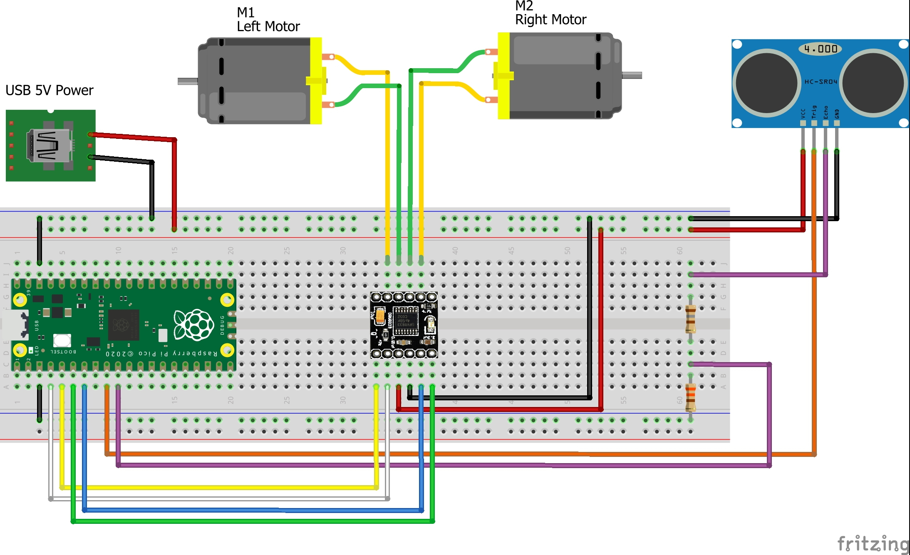

# SERPICO

**S**tudying **E**lectronics and **R**obotics with **PICO**, is a project of Robot based on **Raspberry PI Pico** board.
This code use two PWM Slice, both channels for each slice, one of which with inverted logic, are used to control a **DRV8833** that drives the two DC motors.


## Robot Car Chassis Kit

I used to make the Robot, one of those kits that can be found for a few euro on almost all online stores.
The kit contains everything you need, the base, the motors, the wheels and the wheel. I added a top made with PVC to house the battery in the lower floor, but other solutions can be found in this regard.


## Power

For the power supply of the Robot I used a power bank with two outputs, one of which is connected to the Raspberry PI PICO, via the micro USB connector.
For the other output, I used an old USB cable that I connected directly to the breadboard, to supply the 5V voltage to the motor driver.
**NOTE:** I suggest to use for the power supply of the motors, a power bank that provides more than 1A at the output.

## Circuit

To simplify as much as possible, the realization of the Robot, the circuit is mounted on a bread-board. In the image below you can see the assebly schema.



In the next table the connection between PICO and DRV8833:

|Pico GPIO|DRV8833|
|---|---|
|GPIO 2|IN2|
|GPIO 3|IN1|
|GPIO 4|IN4|
|GPIO 5|IN3|

Other connection of DRV33:

|DRV8833|Motors|USB Power Bank|
| --- | --- | --- |
|VCC||USB 5V Power|
|GND||USB Power GND|
|OUT 1|Right Motor||
|OUT 2|Right Motor||
|OUT 3|Left Motor||
|OUT 4|Left Motor||

Connection between HC-SR04 and PICO:

|HC-SR04|Direction|Pico GPIO|USB Power Bank|
|---|:---:|---|---|
|Trigger| < |GPIO 6|-|
|Echo| > |GPIO 7 (*)|-|
|VCC|-|-|USB 5V Power|
|GND|-|-|USB Power GND|

(*) Attention! Do not connect this pin directly to the Pico, but only with a voltage divider.

## How to compile

Simply follow this istructions:

```bash
$ git clone https://github.com/bobboteck/SERPICO.git
$ cd SERPICO
$ mkdir build
$ cd build
$ PICO_SDK_PATH=~/pico/pico-sdk/
$ cmake ..
$ make
```

The PICO_SDK_PATH is the path where you have cloned the SDK, if you followed the official guide the path in the example is correct.
